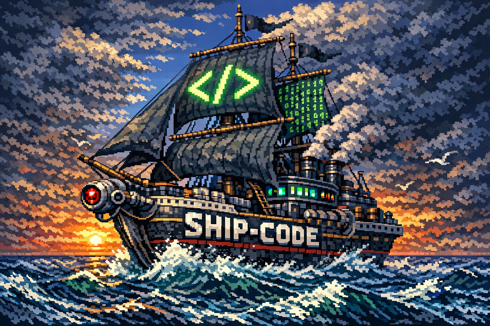

<p align="center">
  
</p>

# ship-code

Anti-slop agentic coding workflow for Claude Code and Codex. 3 agents, no enterprise theater.

**Core philosophy:** Slop is an engineering problem, not an LLM problem. If an agent produces bad code, fix the environment — never patch the output.

## Install

```bash
npx ship-code@latest
```

Prompts you to install globally (all projects) or locally (this project only). Then restart Claude Code and type `/ship-code:` to see all commands.

By default, the npm installer keeps the existing Claude Code behavior. For Codex, install the bundled Codex skill:

```bash
npx ship-code@latest --codex --global
```

Or install both Claude Code commands and the Codex skill:

```bash
npx ship-code@latest --all --global
```

Codex can also install directly from GitHub with its skill installer. Ask Codex:

```text
Install the Codex skill from https://github.com/aliprogrammin/ship-code/tree/main/skills/ship-code
```

Then restart Codex and ask it to use `$ship-code`.

**Flags:**
```bash
npx ship-code@latest --global    # global, no prompt
npx ship-code@latest --local     # project-only, no prompt
npx ship-code@latest --codex     # install Codex skill
npx ship-code@latest --claude    # install Claude Code commands (default)
npx ship-code@latest --all       # install Claude Code + Codex
npx ship-code@latest --uninstall # remove selected target
```

## Upgrading from an older version

v4+ removed the `loop`, `run`, `plan`, and `queue` commands — they're all absorbed into state-aware `ship`. The installer now cleans stale command/agent files on upgrade, so:

```bash
npx ship-code@latest          # global
# or
npx ship-code@latest --local  # this project only
```

Then **restart Claude Code** so slash commands reload. After that, `/ship-code:` should show only five commands.

If you upgraded *before* v4.0.3 and still see old commands, the installer didn't clean up. Do it manually once:

```bash
# Globally installed
rm -rf ~/.claude/commands/ship-code
rm -f  ~/.claude/agents/ship-*.md

# Or project-local
rm -rf .claude/commands/ship-code
rm -f  .claude/agents/ship-*.md

# Then reinstall
npx ship-code@latest
```

Also wipe any pre-v4 runtime cruft from your project (the old prompt-staging folder):

```bash
rm -rf .ship/_prompts
```

Your `.ship/plan.md`, `config.json`, `HARD_BLOCKS.md`, and `issues.md` stay — they're your project's state, not plugin files.

## Commands

Claude Code gets five slash commands. `ship` is state-aware and absorbs the old `loop`, `run`, `plan`, `queue`.

| Command | What it does |
|---|---|
| `/ship-code:init` | Set up hooks, gates, config, hard blocks (works on empty repos) |
| `/ship-code:ship` | State-aware workflow — interview, plan, execute, or resume |
| `/ship-code:quick <desc>` | Small ad-hoc task — gates still enforced |
| `/ship-code:verify` | Run graded quality evaluation standalone |
| `/ship-code:help` | Show the guide |

`ship` takes optional arguments:
- `/ship-code:ship 3` — run just feature 3
- `/ship-code:ship add "OAuth"` — add a feature to the plan
- `/ship-code:ship --plan-only` — plan without executing

In Codex, there are no slash commands. Use natural language:
- `use $ship-code to init this project`
- `use $ship-code to ship this feature: ...`
- `use $ship-code quick to fix ...`
- `use $ship-code verify`

## How It Works

```
You describe what to build
        │
        ▼
  Interview — checkpointed to .ship/draft.md (survives /clear)
        │
        ▼
  Planner:
   - Prior-art sweep → .ship/prior-art.md
   - Scaffolds stack if repo is empty
   - Writes feature briefs → .ship/plan.md
        │
        ▼
  For each feature, Generator-Evaluator loop (max 3 rounds):
   - Generator builds, runs gates, commits
   - Evaluator scores 1-5 on 5 dimensions
   - <3 on any dimension → revise
   - >=3 on all → ship
        │
        ▼
  You review. Push when ready.
```

`ship` is state-aware — no plan means interview, pending plan means resume, shipped plan means prompt to add features.

## The 3 Agents

| Agent | Role |
|---|---|
| **Planner** | Creates feature briefs — what + why, never how |
| **Generator** | Autonomous builder — explores, decides, implements |
| **Evaluator** | Adversarial reviewer — graded rubric, not pass/fail |

### Why only 3?

Modern AI models don't need micro-managed specs with line numbers and step-by-step instructions. They need:
- **Clear goals** (Planner)
- **Autonomy to implement** (Generator)
- **Adversarial quality checks** (Evaluator)

Everything else — complex queue systems, XML task specs, separate research agents, wave orchestration, sprint contracts — is dead weight that actually limits the model's ability to self-correct.

## Evaluator Rubric

Every feature gets scored 1-5 on:

| Dimension | What it measures |
|---|---|
| **Correctness** | Does it meet requirements? |
| **Design** | Does it fit existing patterns? |
| **Code quality** | Is it clean and readable? |
| **Test quality** | Are tests meaningful? |
| **Security** | Is it safe? |

- All >= 3 → **SHIP**
- Any = 2 → **REVISE** (generator gets specific feedback)
- Any = 1 → **REJECT** (generator redoes from scratch)

## Config

`.ship/config.json`:

```json
{
  "workflow": {
    "parallel_features": true,
    "max_eval_rounds": 3,
    "skip_permissions": true
  }
}
```

## The Golden Rules

1. **Never fix bad output.** Reset and fix the brief — not the code.
2. **3 agents, 3 roles.** Planner plans, generator builds, evaluator reviews.
3. **Gates before everything.** Lint + types + tests pass 100% before any commit.
4. **Quality is graded, not binary.** Passing gates is the floor, not the ceiling.
5. **Generator decides the how.** Briefs say what and why. Implementation is autonomous.
6. **Escalate, don't improvise.** If stuck, stop and ask.

## File Structure

```
.ship/
├── config.json        # Settings + stack
├── HARD_BLOCKS.md     # Defaults + rules ingested from CLAUDE.md
├── issues.md          # Agent blockers & learnings
├── draft.md           # Interview checkpoint (transient)
├── prior-art.md       # Competitor/OSS sweep (written by planner)
└── plan.md            # Feature briefs — the source of truth
```

## License

MIT
